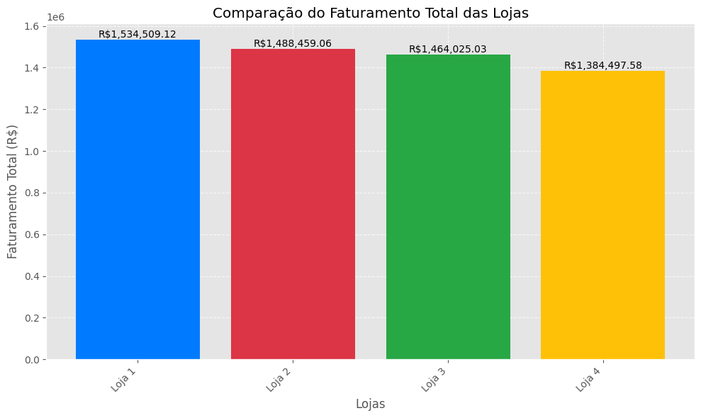
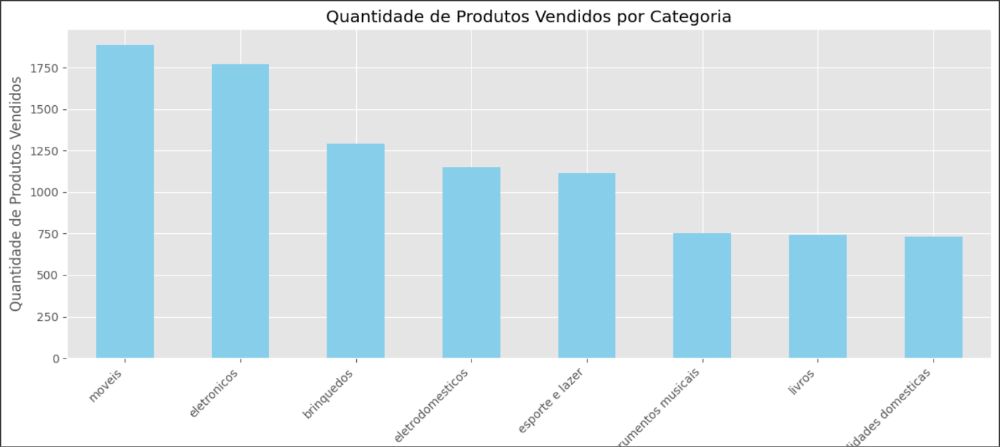

# 🛍️ Alura Store BR - Análise de Vendas


Bem-vindo à **Alura Store BR**, um projeto de análise de dados desenvolvido com Python e pandas. Exploramos o desempenho de quatro lojas virtuais com foco em insights de vendas, categorias mais lucrativas, comportamento do cliente e satisfação geral.

Este notebook foi criado no contexto de um desafio de Data Science da Alura e tem como objetivo aplicar boas práticas de análise exploratória de dados (EDA), visualização e storytelling com dados.

---

## 📊 Sobre o Projeto

O projeto analisa os dados de vendas de **quatro lojas online**, disponíveis em arquivos CSV hospedados no GitHub. Utilizando a biblioteca `pandas` e outras ferramentas de visualização, os dados foram importados, tratados e analisados para responder perguntas importantes, como:

- 💰 Qual loja teve o maior faturamento?
- 📈 Quais categorias geram mais receita?
- 🛒 Quais produtos são os mais e menos vendidos?
- ⭐ Como está a avaliação média das lojas?
- 🧠 Há padrões interessantes no comportamento de compras?

O projeto também explora visualmente os resultados através de gráficos para facilitar o entendimento.

---

## 📁 Estrutura dos Dados

Os dados de cada loja contêm as seguintes colunas:

- **`Produto`**: Nome do produto vendido.
- **`Categoria do Produto`**: Categoria do produto, como móveis, eletrônicos, etc.
- **`Preço`**: Preço unitário do produto.
- **`Frete`**: Valor do frete.
- **`Data da Compra`**: Data em que o produto foi comprado.
- **`Vendedor`**: Nome do vendedor responsável pela venda.
- **`Local da Compra`**: Estado onde a compra foi realizada.
- **`Avaliação da compra`**: Avaliação do cliente (1 a 5 estrelas).
- **`Tipo de pagamento`**: Método de pagamento utilizado (cartão de crédito, boleto, etc.).
- **`Quantidade de parcelas`**: Número de parcelas no pagamento.
- **`lat` e `lon`**: Localização geográfica da compra (latitude e longitude).

---

## 🔍 Etapas da Análise

O notebook está dividido em etapas bem definidas:

1. **Importação e união dos dados**
   - Coleta e integração dos dados de quatro arquivos CSV.
   - Unificação em um único DataFrame.

2. **Análise de Faturamento**
   - Cálculo do faturamento total por loja.
   - Identificação da loja com maior faturamento.
   - Comparação visual do desempenho das lojas.

3. **Vendas por Categoria**
   - Análise da performance por tipo de produto.
   - Identificação das categorias mais vendidas.
   - Visualização das vendas por categoria.

4. **Avaliação dos Clientes**
   - Cálculo da média de avaliações de cada loja.
   - Identificação da loja com melhor avaliação.

5. **Produtos Mais e Menos Vendidos**
   - Identificação dos produtos mais vendidos em cada loja.
   - Identificação dos produtos menos vendidos em cada loja.
   - Visualizações para destacar os resultados.

6. **Insights e Oportunidades**
   - Destaques sobre padrões de comportamento e oportunidades de melhoria.
   - Sugestões para aumentar o faturamento e melhorar a experiência do cliente.

---

## 🛠️ Tecnologias Utilizadas

- [Python 3.x](https://www.python.org/)
- [Pandas](https://pandas.pydata.org/) - Manipulação e análise de dados.
- [Jupyter Notebook](https://jupyter.org/) - Ambiente interativo para análise.
- [Matplotlib](https://matplotlib.org/) & [Seaborn](https://seaborn.pydata.org/) - Visualização de dados.

---

## 💡 Resultados & Insights

### 🔹 **Faturamento Total**
- A loja com maior faturamento foi a **Loja 1**, com um total de **R$ 1.534.509,12**.
- Gráfico comparativo do faturamento entre as lojas:
  

### 🔹 **Categorias Mais Vendidas**
- A categoria mais vendida foi **Móveis**, com um total de **1.886 produtos vendidos**.
- Outras categorias com bom desempenho incluem **Eletrônicos** e **Brinquedos**.
   
### 🔹 **Avaliação Média das Lojas**
- A loja mais bem avaliada foi a **Loja 3**, com uma média de **4,05 estrelas**.

### 🔹 **Produtos Mais e Menos Vendidos**
- Produtos mais vendidos incluem itens como **Guarda-roupas** e **Micro-ondas**.
- Produtos menos vendidos variam entre lojas e incluem itens como **Panela de pressão** e **Headsets**.

### 🔹 **Oportunidades de Crescimento**
- Algumas categorias têm vendas desbalanceadas, como **Instrumentos musicais** e **Livros**, indicando potencial para campanhas de marketing direcionadas.
- Melhorar a experiência do cliente (avaliada pelas notas) pode aumentar a retenção de clientes.

---

## 🚀 Como Executar

1. Clone este repositório:
   ```bash
   git clone https://github.com/seu-usuario/alura-store-br.git

2. Instale as dependências:
   ```bash
   pip install pandas jupyter
   
3. Execute o Jupyter Notebook:
   ```bash
   jupyter notebook AluraStoreBr.ipynb

## 🤝 Contribuições

Ficarei feliz em receber contribuições para o projeto! Para contribuir, siga os passos abaixo:

1. Faça um fork deste repositório.
2. Crie uma branch para sua feature: `git checkout -b minha-feature`.
3. Realize as alterações desejadas e faça um commit: `git commit -m "Minha nova feature"`.
4. Envie suas alterações para o branch: `git push origin minha-feature`.
5. Abra um Pull Request e descreva as mudanças realizadas.

---

## 📅 Roadmap Futuro

- [ ] Adicionar análise de sazonalidade nas vendas.
- [ ] Implementar machine learning para previsão de vendas.
- [ ] Criar um dashboard interativo utilizando ferramentas como Streamlit ou Dash.
- [ ] Incluir análise de comportamento de clientes ao longo do tempo.

---

## 🏷️ Licença

Este projeto está licenciado sob a licença MIT. Consulte o arquivo [LICENSE](./LICENSE) para mais informações.

---

## ❓ FAQ (Perguntas Frequentes)

- **Preciso de experiência com Python para rodar o projeto?**  
  Não necessariamente, mas conhecimento básico em Python e Jupyter Notebook ajudará a entender melhor a análise.

- **Os dados utilizados são reais ou fictícios?**  
  Os dados são fictícios e foram fornecidos no contexto do desafio da Alura.

- **Posso usar este projeto como base para meus estudos ou trabalhos?**  
  Sim! Este projeto foi criado com o propósito de aprendizado, e você pode utilizá-lo como referência ou ponto de partida.

---
